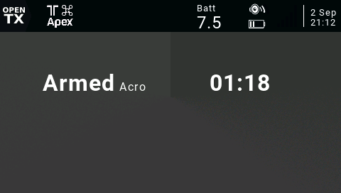
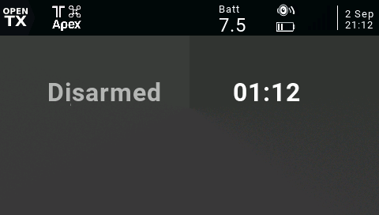
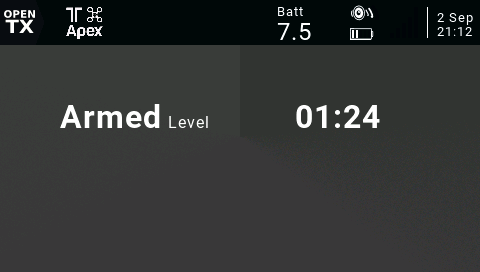

# VtxBar

OpenTX widget for the T16 and TX16S which displays VTx channel based on 6 position switch.

## Disclaimer

This script does not rely on telemetry. It does not reflect the actual craft's state and should not be used in situations where reliable data is critical. It is the user's responsibility to check for correct operation before use.

**IF IN DOUBT, DO NOT FLY!**

## Options

| Option | Description             |
| ------ | ----------------------- |
| Input  | Input that controls VTx |
| Color  | Text color              |

## Installation

Download the `.zip` file from the [latest release](https://github.com/udyux/opentx-widget-vtxbar/releases/latest), extract it and place the folder in the `/WIDGETS/` directory on your transmitter's SD card.

## Usage

For the time being, this widget is intended to be used in the top bar section of the interface.

Simply select the widget, configure the switch you use for controlling the VTx and you're all set.

## Screenshots

 

 

 

 

